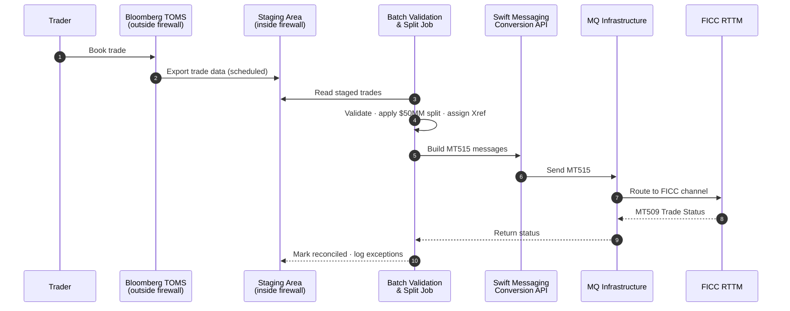
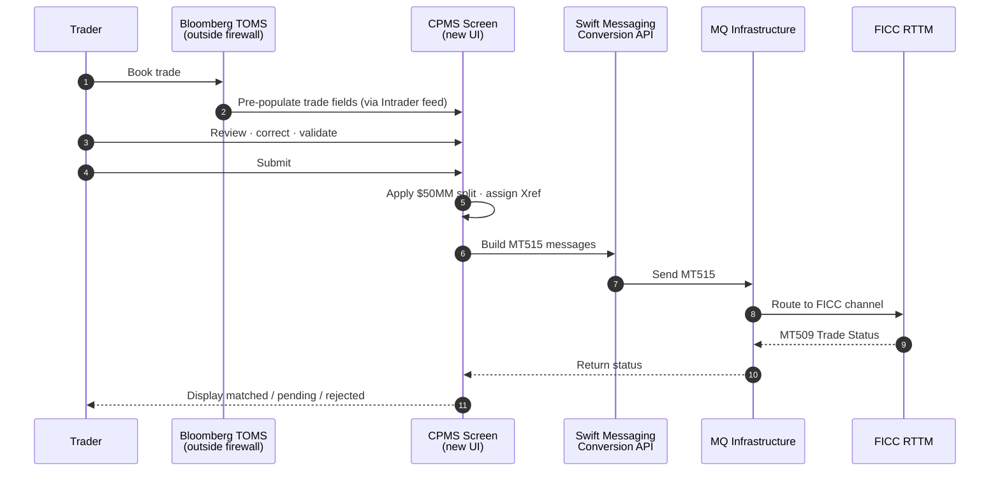

# TPP-10568 — Automation Options for FICC Trade Submission

**Audience:** Diana and stakeholders
**Status:** Options overview — no time estimates at this stage
**Last updated:** 2026-04-21
**Parent spike:** [TPP-10568.md](./TPP-10568.md)

---

## Purpose

Replace the manual Fixed Income Clearing Corporation (FICC) Real-Time Trade Matching (RTTM) website entry with an automated path driven by a regulatory clearing deadline of 2026-12-31 and a Q3 2026 go-live target.

This document summarizes the two viable automation approaches and the tradeoffs between them. Both options share the same back-end plumbing (MT515 messages over Message Queue (MQ) to FICC). They differ in **how trades enter the pipeline** and **how much the user reviews each trade before submission**.

---

## Option 1 — Batch / Staged Submission

Treasury trade data is extracted from Bloomberg Trade Order Management System (TOMS) / Intrader and written to a staging area inside the US Bank firewall. A scheduled job picks up staged records, applies validation and the required $50MM Federal Reserve (FED) split, constructs MT515 messages, and sends them to FICC over Message Queue. FICC status responses (MT509) are logged and reconciled automatically.

**Characteristics:**

- Fully automated once the data lands in staging
- No per-trade user interaction
- Errors surface at batch reconciliation, not at trade entry
- Corrections require back-end fix and re-stage

**Best fit if:** trade volume grows fast, traders trust the Bloomberg source data, and per-trade review is not required.

**Weaker fit if:** traders want to eyeball each trade before it reaches FICC, or if the Bloomberg export is known to have gaps that need human judgment to fill.

---

## Option 2 — New Collateral Pledging Management System (CPMS) Page

A new screen is built inside CPMS that mirrors the RTTM trade-entry layout. Bloomberg TOMS / Intrader data pre-populates the fields. The user reviews, optionally corrects, validates, and submits each trade from the CPMS screen. CPMS then constructs the MT515 and sends it over Message Queue. Status (MT509) appears back on the same screen.

**Characteristics:**

- Human-in-the-loop per trade
- Familiar workflow — looks and feels like RTTM
- Per-trade audit trail tying the Bloomberg source to the FICC submission
- Corrections happen on-screen before submission

**Best fit if:** traders want to review every trade before release, and the volume profile is high but not extreme (tens per day, not thousands).

**Weaker fit if:** daily volumes climb into the hundreds and keyboard-driven review becomes the bottleneck.

---

## Side-by-Side Comparison

| Dimension | Option 1 — Batch | Option 2 — CPMS Page |
|---|---|---|
| Automation level | Fully automated after staging | Automated after user submit |
| User role | Monitor reconciliation | Review and submit each trade |
| Per-trade visibility | Batch-level | Per-trade on screen |
| Correction workflow | Back-end re-stage | On-screen edit |
| Fit at high volume | Stronger | Weaker |
| Fit when traders want control | Weaker | Stronger |
| $50MM split (FED cap) | System-silent | System-visible on screen |
| Trade Cross Reference (Xref) generation | Behind the scenes | Shown to user |
| Dev effort pattern | Integration / data-heavy | User interface plus same integration |
| Fallback if Message Queue fails | Staged data can be replayed | User can resubmit from screen |
| Dependency on CPMS UI stack decision | Low | High |

---

## Relative Build Effort (Rough, Directional)

This is a directional judgment only — not a time or cost estimate. Both options require the same back-end work (Message Queue, MT515 construction, MT509 handling, FICC onboarding). Option 2 adds a full user interface on top of that shared work.

| | Relative effort |
|---|---|
| Option 1 — Batch | **1x** |
| Option 2 — CPMS Page | **~1.5x – 2x** |

The gap is driven primarily by the new user interface in Option 2 (two tabs of fields, pre-population, validation, status display, edit/resubmit workflow) and its dependency on a Collateral Pledging Management System (CPMS) user interface stack decision that is still open.

One caveat could narrow the gap: if the Intrader export needs heavy transformation or reconciliation before it can be submitted, Option 1's middle layer grows. That question is not yet answered.

---

## What Both Options Share

Both options require the same downstream components, so work on either starts the same conversations:

- **FICC Message Queue channel onboarding** — 20 to 30 business days lead time; starts with Message Queue Page 1 submission (Edward Pinto at Depository Trust & Clearing Corporation (DTCC))
- **MT515 message construction** — extend the Swift Messaging Conversion Application Programming Interface (API) to build MT515 messages (Streetcar / Jose)
- **MT509 response handling** — CPMS receives trade status
- **$50MM FED split logic** — applies to any Delivery Versus Payment (DVP) trade over the cap
- **Counterparty to FICC firm identifier mapping**
- **Audit logging of every outbound MT515 and inbound MT509**

---

## What Is Not Yet Decided

| Item | Owner |
|---|---|
| Which option to pursue | Business line + Parshwa Shah |
| Intrader export mechanism and field list | Brian Goetter (Money Center Trading) |
| CPMS user interface technology stack (only matters for Option 2) | John |
| Delivery Versus Payment (DVP) repo — Option A (new entry screen) vs Option B (defer) | Parshwa Shah |
| Whether the US Bancorp Investments (USBI) Phase 3 Message Queue channel can be reused | Edward Pinto (DTCC) |

---

## Flow Diagrams

### Option 1 — Batch / Staged Submission

### Option 2 — New CPMS Page

