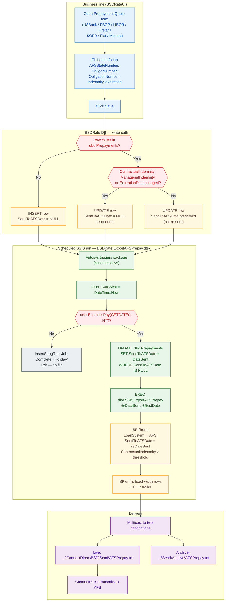

# Export to AFS

This document describes how BSDRate sends data to AFS (Automated Financial Systems). There are two independent export flows and one inbound reconcile flow — all use the string "AFS" in code, so they are easy to confuse.

| Flow | Trigger | UI | DB write path | SSIS package | Output file |
|------|---------|----|---------------|--------------|-------------|
| **Prepayment quotes → AFS** | Scheduled SSIS run (business days); business line only *saves* the quote — there is no user-facing "Send" action | `BSDRateUI/Prepayment Quotes/*` | `dbo.Prepayments` (`SendToAFSDate`) | `BSDRate ExportAFSPrepay.dtsx` | `AFSPrepay.txt` |
| **Rate values → AFS** | Scheduled rate publish | `BSDRateUI/Rates/ExportRateSchedulesForm.vb` | `ExportRateValues` / `ExportColumnValues` | `BSDRate ExportAFSRates.dtsx` | rate file |
| **AFS reference numbers ← AFS** (inbound, not an export) | Daily import from AFS | (reconciled in `RateLockNotOnAFS.vb`) | `dbo.IAFSReferenceNumbers` | `BSDRate ImportAFSReferenceNumbers.dtsx` | — |

The rest of this document covers the **Prepayment quotes → AFS** flow, since that is the "form the business line fills out" path. Rate export is a separate topic.

---

## 1. Business-line data entry (UI)

Under `BSDRateUI/Prepayment Quotes/`, the business line opens one of the following per-quote forms depending on loan type:

- `USBankPrepayment.vb`
- `FirstarPrepayment.vb`
- `FBOPPrepayment.vb`
- `LIBORPrepayment.vb`
- `SOFRTermCurvePrepayment.vb`
- `FlatChargePrepayment.vb`
- `ManualPrepayment.vb`

All inherit from `PrepaymentBase.vb`. Loan / obligor identification is captured on `LoanInfo.vb`, which owns the AFS-specific fields:

- `AFSStateNumberTreasuryTextBox` — the two-digit AFS state number (see `LoanInfo.vb:225`)
- `ObligorNumber`, `ObligationNumber` — the identifiers AFS uses to look up the loan

The AFS state number and obligor / obligation numbers are the join key on the AFS side; without them the export record is meaningless.

## 2. Persist to `dbo.Prepayments`

Every save goes through the upsert procedure in `BSDRate_Database.sql` (around line 59680) which writes/updates `dbo.Prepayments`. AFS-relevant columns on that table:

- `AFSStateNumber`
- `ObligorNumber`, `ObligationNumber`
- `ContractualIndemnity`, `ManagerialIndemnity`
- `ExpirationDate`
- `LoanSystemID` (must join to `LLoanSystems` where `Code = 'AFS'` to be picked up by the export)
- `SendToAFSDate` — watermark for "row has been included in a send run". `NULL` means "queued for the next scheduled send". The SSIS package (§3) stamps it during the run; the upsert SP never assigns it.

### Re-send logic

On update, the SP nulls `SendToAFSDate` if any of the following changed since the last save (`BSDRate_Database.sql:59747-59751`):

- `ContractualIndemnity`
- `ManagerialIndemnity`
- `ExpirationDate`

That is how an edited quote gets re-queued for the next export. If none of those fields change, the existing `SendToAFSDate` is preserved and the row will not be re-sent.

There is **no user-triggered "Send to AFS" action**. Saving the quote is the whole business-line workflow; picking up NULL rows is entirely the SSIS package's job.

## 3. SSIS package: `BSDRate ExportAFSPrepay.dtsx`

Location: `SSIS/BSDRate ExportAFSPrepay.dtsx`

Runtime behaviour:

1. Sets `User::DateSent = DateTime.Now` at package start (`dtsx:995`).
2. Runs a business-day check via `dbo.udfIsBusinessDay(GETDATE(),'NY')`. Non-business days short-circuit the flow (`dtsx:308`).
3. **Stamps all pending rows** — runs
   ```sql
   Update dbo.Prepayments
   SET SendToAFSDate = ?    -- User::DateSent
   WHERE SendToAFSDate is null
   ```
   (`dtsx:754`). This is how a saved quote gets picked up: the upsert SP leaves `SendToAFSDate` NULL for new/changed rows, and the SSIS run claims them all under a single `DateSent` value.
4. Executes:
   ```sql
   EXEC [dbo].[SSISExportAFSPrepay] @DateSent = ?, @testDate = ?
   ```
   (`dtsx:501-502`, parameter mapping at `dtsx:523`) — with the same `DateSent` value, so it picks up exactly the rows just stamped.
5. Streams the SP result set to two flat-file destinations (the live drop and an archive copy):
   - Live: `\\us.bank-dns.com\NAS\pri\treasury-app_<env>\FileTransfer\ConnectDirect\BSD\Send\<Env>\AFSPrepay.txt`
   - Archive: `...\Send\Archive\<Env>\AFSPrepay.txt`
   Connection strings assembled from SSIS variables `vBSDSendFilePath`, `vBSDSendArchiveFolder`, and `AFSPrepayFileLocationName`.
6. ConnectDirect picks up the live file and transmits it to AFS.

## 4. Stored procedure: `dbo.SSISExportAFSPrepay`

Body starts at `BSDRate_Database.sql:52523`. Signature:

```sql
CREATE PROCEDURE [dbo].[SSISExportAFSPrepay]
    @DateSent DateTime,
    @testDate DateTime = NULL
```

### Selection criteria

```sql
FROM   dbo.Prepayments p
JOIN   dbo.LLoanSystems ls ON ls.IID = p.LoanSystemID AND ls.Code = 'AFS'
WHERE  p.SendToAFSDate = @DateSent
  AND  p.ContractualIndemnity > @minChargeAmt
```

- `@minChargeAmt` is pulled from `UAppConfig.ConfigKey = 'PrePaymentChargeThreshold'` for the current environment. Anything at or below the threshold is excluded (issue #713, floor is $100 in prod).
- `LoanSystemID` must resolve to the AFS loan system — LIQ prepayments live in the same table but are not sent here (see the 09/25/13 change note).
- The rows matched here are the ones the SSIS package just stamped in step 3 of §3 (`SendToAFSDate = @DateSent WHERE SendToAFSDate IS NULL`). The SP has no queuing logic of its own — it emits whatever the package stamped this run.

### Output record layout

The SP emits a `FileData` column that is the concatenation of these fixed-width fields, in order:

| Field | Width | Format / notes |
|-------|-------|----------------|
| `AFSStateNumber` | 2 | `STR(x, 2)` right-justified, space-padded → zero-padded via REPLACE |
| FILLER1 | 2 | spaces |
| `ObligorNumber` | 10 | zero-padded |
| FILLER2 | 2 | spaces |
| `ObligationNumber` | 10 | zero-padded |
| FILLER3 | 2 | spaces |
| Indemnity | 15 | `CONTRACTUAL` indemnity × 100 (cents), zero-padded left. Per issue #569, contractual is always used regardless of breakfunding type. |
| FILLER4 | 2 | spaces |
| `Date` | 8 | `ExpirationDate` shifted by `@testDateDiff`, formatted `MMDDYYYY` (from `CONVERT(varchar(10), ..., 101)` with `/` stripped) |

A trailer record is appended:

```
'HDR' + MMDDYYYY(now + testDateDiff) + zero-padded count(10)
```

### `@testDate` — WR14148

`@testDate` supports AFS's UAT calendar. The SP computes:

```sql
@testDateDiff = DATEDIFF(day, @DateSent, @testDate)
```

and shifts both the `Date` column and the header date by `@testDateDiff`. Prod calls pass NULL (the SP interprets `NULL` or `12/30/1899` as "no shift", so `@testDate = @DateSent` and `@testDateDiff = 0`).

## 5. Reconciliation (not export)

`BSDRateUI/RateLockNotOnAFS.vb` is the **inverse** flow and is easy to confuse with the export:

- It reads `dbo.IAFSReferenceNumbers` (loaded by `BSDRate ImportAFSReferenceNumbers.dtsx`) and reports rate locks in BSDRate that have no matching AFS reference.
- It lets the treasury desk email the missing rate locks to the business line (`ReconcileData.EmailRateLockNotOnAFS`, `RateLockNotOnAFS.vb:393`).
- It does not push data to AFS.

If someone says "the AFS form", they may mean this reconcile screen rather than the prepayment quote flow — worth confirming before touching either side.

## 6. Related but out of scope

- `BSDRate ExportAFSRates.dtsx` / `[dbo].[SSISExportAFSRates]` — rate publishing pipeline (Rates/ExportRateSchedulesForm) with its own file format, sourced from `ExportRateDefinitions` / `ExportColumnValues`.
- `BSDRate Stage AFSLIQ Rates.dtsx`, `BSDRate Import AFS SAR Values.dtsx` — inbound from AFS.
- `dbo.vAFSLIQRateDetails`, `dbo.vAFSLIQRateValues`, `dbo.vAFSRatesToday` — reporting views for the rate side, not the prepayment side.

## Quick reference — files

| Purpose | Path |
|---------|------|
| Business-line quote forms | `BSDRateUI/Prepayment Quotes/*Prepayment.vb` |
| Base class | `BSDRateUI/Prepayment Quotes/PrepaymentBase.vb` |
| AFS fields on the quote | `BSDRateUI/Prepayment Quotes/LoanInfo.vb` |
| Upsert SP (sets/clears `SendToAFSDate`) | `BSDRate_Database.sql:59680` |
| Export SP | `BSDRate_Database.sql:52523` (`dbo.SSISExportAFSPrepay`) |
| SSIS export package | `SSIS/BSDRate ExportAFSPrepay.dtsx` |
| Reconcile UI (inverse) | `BSDRateUI/RateLockNotOnAFS.vb` |

## End-to-end flow



The important takeaway from the chart: the arrow from **Save** to the **scheduled SSIS run** is not synchronous — the row just sits with `SendToAFSDate = NULL` until the next scheduled sweep, and there is no business-line action between them.
