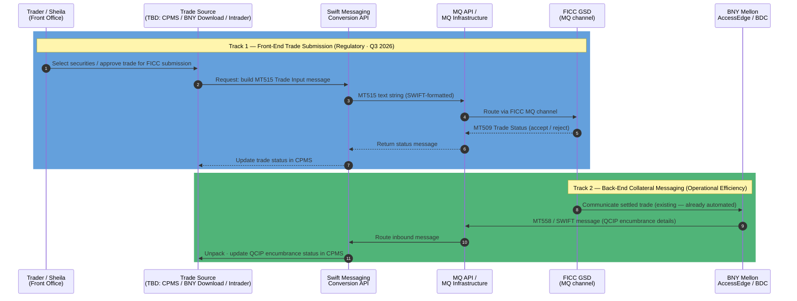

# TPP-10568 — SPIKE: Automate Treasury Trade Submission to Fixed Income Clearing Corporation (FICC) Real-Time Trade Matching (RTTM) Website

| Field | Value |
|---|---|
| **Type** | Spike |
| **Priority** | P2 - High/Critical |
| **Status** | In Progress |
| **Assignee** | Doug Tolley |
| **Reporter** | Parshwa Shah |
| **Sprint** | 2026 TPP OPI Sprint 7 |
| **Story Points** | 5 |
| **Epic** | TPP-6209 |
| **Component** | Collateral Pledging Management System (CPMS) (2165) |
| **Labels** | AFE43967, CPMS |
| **Impact** | 5 - Very High |
| **PRISM** | No |
| **ROAM** | Identified |
| **Risk/Issue Category** | Project/Program Management |
| **Funding Source** | Unknown |
| **Tagging** | TBD |
| **Cloned From** | TPP-10560 |
| **Created** | 2026-03-27 |
| **Updated** | 2026-04-02 |

---

## Background / Current State

Treasury trade settlement for Delivery Versus Payment (DVP), repo, cash buys, and cash sells is currently performed via **manual entry into the Fixed Income Clearing Corporation (FICC) Real-Time Trade Matching (RTTM) website**, with each entry capped at **$50MM increments**. This process is labor-intensive, error-prone, and limits scalability as volumes increase.

FICC supports Message Queue (MQ) messaging, but this capability is not currently leveraged, resulting in continued reliance on manual workflows.

---

## Problem Statement

Manual trade entry into Fixed Income Clearing Corporation (FICC) Real-Time Trade Matching (RTTM):

- Constrains throughput
- Increases operational risk and error rates
- Introduces settlement delays
- Will **not scale** with increased volumes driven by **regulatory clearing mandates** (effective 12/31/2026)

---

## Business Objective

Evaluate and define a path to automate Treasury trade submission to Fixed Income Clearing Corporation (FICC) by leveraging **FICC-enabled Message Queue (MQ) messaging**, eliminating manual Real-Time Trade Matching (RTTM) entry and enabling scalable, controlled, and auditable settlement processing.

Answer key feasibility and design questions needed to decide **how** and **where** automation should occur.

---

## Regulatory Context

A **Treasury Clearing Rule** goes into effect **12/31/2026** requiring all treasury activity — whether repo, cash buys, or cash sells — to clear through a clearing corporation. US Bank's clearing corp is **Fixed Income Clearing Corporation (FICC)**.

- No more bilateral trades (e.g., US Bank directly to JP Morgan)
- All US Treasury securities (bonds, bills, notes) must clear through Fixed Income Clearing Corporation (FICC)
- This significantly increases volume through FICC — especially from the Money Center Trading group

> **Target Go-Live: Q3 2026 (September)** — blackout periods begin **November 1, 2026**

---

## Current Process Flow

```
Front Office (Sheila / Money Center / Investment Portfolio (IP))
  → Manually log into Fixed Income Clearing Corporation (FICC) Real-Time Trade Matching (RTTM) website
  → Book trade (repo or cash buy/sell)
  → FICC communicates with Bank of New York Mellon (BNY Mellon) (Nexon / Access Edge)
  → BNY Mellon identifies Qualified Collateral Instruments/Pledged (QCIPs) to be encumbered or released
  → Eric's team (Back Office) manually handles BNY Mellon side
  → Updates flow into Collateral Pledging Management System (CPMS)
```

### How Traders Book the Trade on FICC

Traders book into the Real-Time Trade Matching (RTTM) website from the front office. The details are based on trades completed with brokers — typically negotiated via chat. For buying or selling Treasuries specifically, traders book those in the **Trade Order Management System (TOMS) within Bloomberg**, and from there the trade will need to flow into Real-Time Trade Matching (RTTM).

**Spike process mapping scope:**
- Manual Real-Time Trade Matching (RTTM) entry vs. future automated flow
- Stakeholder identification (Business, Operations, Tech, Fixed Income Clearing Corporation (FICC))

---

## Future State Flow

Two parallel tracks. Track 1 has a regulatory deadline; Track 2 is operational efficiency with no hard deadline.

The preferred architecture (per Kurt, 2026-04-03) is **Collateral Pledging Management System (CPMS)-centric**: CPMS drives message construction, a Swift Messaging Conversion Application Programming Interface (API) builds the SWIFT-formatted text, and a Message Queue (MQ) Application Programming Interface (API) routes messages to the correct channel (Fixed Income Clearing Corporation (FICC) or Bank of New York Mellon (BNY Mellon)).

> **Note:** Fixed Income Clearing Corporation (FICC) / Government Securities Division (GSD) does **not** use the SWIFT network. It uses its own proprietary network with SWIFT-standardized (ISO 15022) message formats transmitted over Message Queue (MQ). The message formats look like SWIFT but travel over FICC's own infrastructure.



**Notes:**
- **Trade source is still to be determined (TBD)** for all three user groups — see open questions in `todo.md`. The Delivery Versus Payment (DVP) / Funding (Sheila) group has no front-end system, making this the highest-uncertainty gap.
- Track 2 money amounts (cash buys/sells from Money Center) are **excluded** from Collateral Pledging Management System (CPMS) — purely transactional, not pledged or encumbered.
- Fixed Income Clearing Corporation (FICC) ↔ Bank of New York Mellon (BNY Mellon) communication already exists and is automated; US Bank does not touch that leg.
- US Bancorp Investments (USBI)'s Phase 3 already connects to FICC — reference architecture candidate for Track 1.

---

## FICC Interactive Messaging — Message Formats

Source documents: **GSD200** (Comparison Input & Output, March 2023) and **GSD149** (Netting Output, January 2021), both from Depository Trust & Clearing Corporation (DTCC) / Fixed Income Clearing Corporation (FICC) Government Securities Division (GSD).

### Track 1 — Trade Comparison Messages (GSD200)

These are the messages used to **submit trades to FICC** and receive back status. These replace what Sheila currently does manually on the Real-Time Trade Matching (RTTM) website.

| Message | Direction | Purpose |
|---|---|---|
| **MT515** | US Bank → FICC | Trade Input — submits a trade to GSD for comparison. Three styles: **DVP** (Delivery Versus Payment), **GCF** (General Collateral Finance), **CCIT** (Centrally Cleared Institutional Triparty). This is the core message for Track 1. |
| **MT509** | FICC → US Bank | Trade Status — FICC acknowledges or rejects each MT515 submitted. Also sent intra-day as trade status changes (compared, canceled, modified). |
| **MT518** | FICC → Counterparty | Contra-Side — FICC notifies the counterparty that a trade has been submitted against them. |
| **MT599** | FICC → US Bank | Administrative — system availability and major system events. |

### Netting Output Messages (GSD149)

Messages FICC sends after the netting cycle runs.

| Message | Direction | Purpose |
|---|---|---|
| **MT509** | FICC → US Bank | Netting Status — post-netting trade status. |
| **MT548** | FICC → US Bank | Settlement Status — settlement outcome of netted obligations. |
| **MT590** | FICC → US Bank | General message. |
| **MT950** | FICC → US Bank | Statement — full position / obligation statement. |

---

## BNY Mellon SWIFT Message Formats (Track 2)

### Tri-Party Collateral Management (MT527 / MT558)

Source document: **SWIFT Tri-Party Collateral Management — Format Specifications for MT527 and MT558**, BNY Mellon, June 14, 2023.

| Message | Direction | Purpose |
|---|---|---|
| **MT527** | US Bank → BNY Mellon | Tri-Party Collateral Instruction — initiates, modifies, or terminates a collateral allocation. |
| **MT558** | BNY Mellon → US Bank | Tri-Party Collateral Status and Processing Advice — BNY Mellon confirms status of collateral allocation (matched, unmatched, settled, rejected). |

> This corresponds to BNY Mellon's Automated Deal Matching (ADM) facility / RepoEdge (RE) system. AccessEdge is the user interface for the RepoEdge system.

### FED Securities Settlement — BDC Platform (MT540–MT548)

Source document: **SWIFT FED Clearance MT540–MT548 Message Processing Instruction Specification Guide for Users of the BDC System**, BNY Mellon, July 6, 2023.

BDC stands for Broker Dealer Clearance — BNY Mellon's platform for Federal Reserve Bank (FED) securities settlement.

| Message | Direction | Purpose |
|---|---|---|
| **MT540** | US Bank → BNY | Receive Free — receive securities with no payment |
| **MT541** | US Bank → BNY | Receive Against Payment — receive securities vs. payment (standard DVP receive leg) |
| **MT542** | US Bank → BNY | Deliver Free — deliver securities with no payment |
| **MT543** | US Bank → BNY | Deliver Against Payment (DVP) — deliver securities vs. payment (standard DVP deliver leg) |
| **MT544** | BNY → US Bank | Receive Free Confirmation |
| **MT545** | BNY → US Bank | Receive Against Payment Confirmation |
| **MT546** | BNY → US Bank | Deliver Free Confirmation |
| **MT547** | BNY → US Bank | Deliver Against Payment Confirmation |
| **MT548** | BNY → US Bank | Settlement Status and Processing Advice |

---

## Existing Infrastructure and Work Already In Progress

Key findings from Kurt's meeting (2026-04-03):

| Item | Status | Notes |
|---|---|---|
| MQ production infrastructure | **Exists** | Channels to BNY Mellon are built and working. FICC channel status unknown — needs confirmation. |
| Swift Messaging Conversion API | **Partially built** | Offshore team / Intrader team has programmed two BNY Mellon message types in Java. Not complete for FICC. |
| General Collateral Finance (GCF) bulk download / CPMS upload | **In UAT** | Vin downloads a spreadsheet from BNY Mellon's AccessEdge / BDC system, then uses CPMS bulk upload function. Not yet in production. |
| CPMS-centric architecture design | **Proposed** | Kurt's preferred approach. CPMS is the hub; Swift API and MQ API are service layers. |

### Design Constraints

- **No Bank of New York Mellon screen or system modifications** — US Bank cannot add or change any screens or functionality in Bank of New York Mellon's systems (AccessEdge, BDC, Nexen, or any other Bank of New York Mellon platform). All Bank of New York Mellon interaction must use their existing download/export capabilities as-is.
- **A new Collateral Pledging Management System (CPMS) user interface will be built** — management decision (2026-04-06). Sheila and other users will interact through a new Collateral Pledging Management System (CPMS) screen for trade submission and status. The email approval workflow concept is off the table.
- **Sheila's legacy Microsoft Access tracking system** — do not build any integration or accommodation for this system. It is unsupported and not a path forward.

### Confirmed Data Flow for Sheila's Delivery Versus Payment / Funding Group

1. Bank of New York Mellon AccessEdge — Vin (or Sheila) uses the **existing** download to export Delivery Versus Payment trade / collateral data as a spreadsheet
2. Collateral Pledging Management System (CPMS) bulk upload ingests the download — same mechanism already used for General Collateral Finance trades (in UAT)
3. Sheila opens the **new Collateral Pledging Management System (CPMS) submission screen** — reviews trades, selects, and approves for Fixed Income Clearing Corporation (FICC) submission
4. Collateral Pledging Management System (CPMS) triggers the MT515 → Message Queue → Fixed Income Clearing Corporation (FICC) flow
5. Fixed Income Clearing Corporation (FICC) MT509 response is displayed on the **status screen** in Collateral Pledging Management System (CPMS)

### Parallel Work Approach (Kurt's Recommendation)

Rather than waiting for end-to-end design, Kurt recommended starting in the middle and working outward simultaneously:

1. **Identify the correct MT515 message style** (DVP vs. GCF vs. CCIT) for each trade type → work this now.
2. **Backwards**: identify trade data source and build queries/mapping to populate the MT515 fields.
3. **Forwards**: engage FICC (ficcintegration@dtcc.com) to establish MQ connectivity and confirm onboarding requirements.

---

## User Groups

| Group | System | Notes |
|---|---|---|
| **Funding / Delivery Versus Payment (DVP)** (Sheila) | No front-end system yet | Currently highest manual burden on Real-Time Trade Matching (RTTM) |
| **Money Center Trading** | Bloomberg Trade Order Management System (TOMS) → Intrader | New volume driver under regulatory deadline |
| **Investment Portfolio (IP)** (under Jeff) | Bloomberg Trade Order Management System (TOMS) → Intrader | Lower volume but same fix applies |

All three groups are subject to the Treasury Clearing Rule and will need to route through Fixed Income Clearing Corporation (FICC).

> **Top priority identified**: Getting Money Center Trading and Investment Portfolio trades from Bloomberg Trade Order Management System (TOMS) / Intrader into Fixed Income Clearing Corporation (FICC) automatically.

---

## Two Automation Tracks

### Track 1 — Front-End Trade Submission (Regulatory — High Priority)
Automate trade entry from source systems (Bloomberg Trade Order Management System (TOMS) / Intrader) into Fixed Income Clearing Corporation (FICC) Real-Time Trade Matching (RTTM), eliminating manual website entry.

- **Deadline**: Q3 2026
- **Covers**: Delivery Versus Payment (DVP), repo, cash buys/sells for all three user groups
- **Reference**: US Bancorp Investments (USBI) uses Phase 3 which already connects to FICC — potential reference architecture

### Track 2 — Back-End Collateral Messaging (Operational Efficiency)
Receive Swift / Message Queue (MQ) messages from Bank of New York Mellon (BNY Mellon) identifying encumbered/released Qualified Collateral Instruments/Pledged (QCIPs) and route them into Collateral Pledging Management System (CPMS).

- **Deadline**: No regulatory deadline — operational efficiency
- **Challenge**: No current landing zone at US Bank for these Swift messages
- **Glenn's team** is building a Swift messaging conversion Application Programming Interface (API)
- MQ infrastructure to BNY Mellon already exists; Swift API partially built (two message types in Java)

> Note: Treasury cash buys/sells (Money Center) are **excluded** from the Collateral Pledging Management System (CPMS) collateral discussion — they are purely transactional and not pledged/encumbered.

---

## Key Stakeholders

| Name | Role |
|---|---|
| Sheila | Front Office — Funding / Delivery Versus Payment (DVP), subject matter expert on Fixed Income Clearing Corporation (FICC) Real-Time Trade Matching (RTTM). May have FICC contact. |
| Eric | Back Office — Bank of New York Mellon (BNY Mellon) / Qualified Collateral Instrument/Pledged (QCIP) encumbrance side |
| Vin | Operations — performs the General Collateral Finance (GCF) trade download from BNY Mellon AccessEdge and bulk upload into Collateral Pledging Management System (CPMS). |
| John | Tech lead discussion participant |
| Parshwa Shah | JIRA reporter / product owner |
| Diana | Stakeholder (shared Depository Trust & Clearing Corporation (DTCC) documentation) |
| Glenn | Tech team — Swift messaging conversion Application Programming Interface (API) build |
| Kurt | Tech — provided FICC Message Queue (MQ) specifications, CPMS-centric architecture, and supporting BNY Mellon documents |
| Corey Starr | Prioritization / Christine's world |
| Jeff | Head of Investment Portfolio (IP) front office |
| FICC Integration Team | External — FICC connectivity onboarding contact: ficcintegration@dtcc.com |

---

## Acceptance Criteria

- [ ] Future-state automated flow leveraging Fixed Income Clearing Corporation (FICC) defined at a high level
- [ ] Backlog created for offshore team
- [ ] Document how to automate the current trade entry process on Fixed Income Clearing Corporation (FICC) Real-Time Trade Matching (RTTM) website

---

## Subtasks

| Ticket | Description | Depends On |
|---|---|---|
| TPP-10569 | MT515 Mandatory Field Data Mapping and Gap Analysis | None — start immediately |
| TPP-10570 | Build Counterparty Fixed Income Clearing Corporation (FICC) Firm ID Reference Table | TPP-10569 |
| TPP-10571 | Extend Swift Messaging Conversion Application Programming Interface (API) to Build MT515 Trade Input Messages | TPP-10569, TPP-10570 |
| TPP-10572 | Handle MT509 Trade Status Responses from Fixed Income Clearing Corporation (FICC) into Collateral Pledging Management System (CPMS) | TPP-10571, TPP-10573 |
| TPP-10573 | Establish Fixed Income Clearing Corporation (FICC) Message Queue (MQ) Channel in Existing MQ Infrastructure | None — run in parallel |
| TPP-10574 | Extend Bank of New York Mellon Delivery Versus Payment Download and Collateral Pledging Management System (CPMS) Bulk Upload for Delivery Versus Payment Trades | TPP-10569 |
| TPP-10575 | Build Collateral Pledging Management System (CPMS) Fixed Income Clearing Corporation (FICC) Trade Submission and Status User Interface | TPP-10569, TPP-10571, TPP-10572, TPP-10574 |

---

## Fixed Income Clearing Corporation (FICC) Real-Time Trade Matching (RTTM) Website — Manual Entry Detail

**System**: Depository Trust & Clearing Corporation (DTCC) | Government Securities Division (GSD) Real-Time Trade Matching (RTTM) Web
**URL**: `https://gsd-ficcweb.dtcc.net/#/trade/entry`
**US Bank Member ID**: 9286 — U.S. BANK NATIONAL ASSOCIATION
**Current user**: Sheila Pajerski (Front Office)
**Nav sections**: Dashboard, Trades, Obligations, Substitutions, Tools, Reports

The Trade Entry screen has two tabs, one per trade type:

### Tab 1 — Repo / Revr (`GSD_RTTM_WEB_TradeEntry.jpg`)

**Trade Details** (header fields, one per trade):

| Field | Required | Notes |
|---|---|---|
| Member ID | Yes | Pre-filled: 9286-U.S. BANK NATIONAL ASSOCIATION |
| Product | Yes | Delivery Versus Payment (DVP) or General Collateral Finance (GCF) / Centrally Cleared Institutional Triparty (CCIT) (radio buttons) |
| Committee on Uniform Securities Identification Procedures (CUSIP) | Yes | Searchable |
| Trader ID | No | |
| Trade Date | Yes | |
| Trade Time | No | |
| Start Date | Yes | |
| Settlement Date | Yes | |
| Executing Firm Symbol | No | |
| Broker Cross Reference (Xref) | No | |
| Transaction Type | Yes | Repo or Reverse (checkboxes) |

**Repo Transaction(s)** (line-item rows, supports "+ Add Row"):

| Field | Required |
|---|---|
| Par | Yes |
| Start Money | Yes |
| Repo Rate (%) | Yes |
| Final Money | No |
| Accrued To Date | No |
| Contra ID | Yes (dropdown) |
| Contra Executing Firm | No |
| Trade Cross Reference (Xref) | Yes |

---

### Tab 2 — Buy / Sell (`GSD_RTTM_WEB_BuySell.jpg`)

**Trade Details** (header fields):

| Field | Required | Notes |
|---|---|---|
| Member ID | Yes | Pre-filled: 9286-U.S. BANK NATIONAL ASSOCIATION |
| Product | Yes | Delivery Versus Payment (DVP) only |
| Committee on Uniform Securities Identification Procedures (CUSIP) | Yes | Searchable |
| Trader ID | No | |
| Trade Date | Yes | |
| Trade Time | No | |
| Settlement Date | Yes | |
| Pricing Method | Yes | Dropdown |
| Executing Firm Symbol | No | |
| Broker Cross Reference (Xref) | No | |
| Transaction Type | Yes | Buy or Sell (checkboxes) |

**Buy/Sell Transaction(s)** (line-item rows, supports "+ Add Row"):

| Field | Required | Notes |
|---|---|---|
| Par | Yes | |
| Price | Yes | Must be a valid decimal — "1m" shown as **Invalid** in screenshot |
| Settlement Amount | No | |
| Commission | No | |
| Contra ID | Yes (dropdown) | |
| Contra Executing Firm | No | |
| Trade Cross Reference (Xref) | Yes | |

> Both screens end with **RESET / VALIDATE / SUBMIT** buttons. Each trade row is entered and submitted manually — capped at $50MM par per submission.
>
> **Note**: Screenshots were captured during a live demo for illustration purposes. Any validation errors visible (e.g., "Invalid" price) are artifacts of the demo and not representative of production data.

---

## Comments

**2026-03-31** — Started research understanding story and system.

**2026-03-31** — Open questions identified:
- Technical details: No mention of existing Message Queue (MQ) infrastructure or technical prerequisites
- Fixed Income Clearing Corporation (FICC) Application Programming Interface (API) documentation: Are we already certified/registered with FICC for automated submission?
- Data source: Where does trade data originate? What system integration is needed?
- Compliance/audit: Security, audit trail, and reconciliation requirements not mentioned
- Rollback plan: How to handle failures? Manual fallback procedures?
- Volume estimates: What are current and projected trade volumes?

**2026-04-02** — Waiting for Kurt to return to office for information needed for this task.

**2026-04-06** — Kurt meeting (2026-04-03). Key findings incorporated into this document:
- FICC Interactive Messaging (IM) message formats confirmed: MT515 (inbound trade submission), MT509 (status response), MT518 (contra-side notification). Full specs in GSD200 and GSD149.
- BNY Mellon SWIFT message formats confirmed: MT527/MT558 (tri-party collateral), MT540–MT548 (BDC FED settlement).
- CPMS-centric architecture is the preferred design: CPMS → Swift API → MQ API → FICC.
- MQ production infrastructure already exists (BNY Mellon channels live). FICC channel status unknown.
- Swift Messaging Conversion API partially built in Java (two BNY Mellon message types). Not complete for FICC.
- General Collateral Finance (GCF) quick fix (Vin's BNY download → CPMS bulk upload) is in UAT.
- Sheila's legacy Microsoft Access tracking system must not be integrated.
- FICC uses SWIFT-formatted messages (ISO 15022) but over its own proprietary MQ network, not the SWIFT network.
- FICC Integration contact for connectivity onboarding: ficcintegration@dtcc.com.
- Remaining open question: trade source for each user group (CPMS vs. BNY Mellon download vs. Intrader).

---

## Glossary

| Term | Full Name | Description |
|---|---|---|
| **TOMS** | Trade Order Management System | Bloomberg's platform for order entry, execution, and position tracking. Used by Money Center Trading and Investment Portfolio to book Treasury buy/sell trades. |
| **Intrader** | Intrader | US Bank's internal system where Bloomberg TOMS positions are recorded after a trade is booked. |
| **FICC** | Fixed Income Clearing Corporation | The clearing corporation through which all US Treasury trades must clear. A subsidiary of DTCC. US Bank's clearing corp under the Treasury Clearing Rule. |
| **RTTM** | Real-Time Trade Matching | FICC's web-based trade entry and matching system. Currently used by Sheila (front office) to manually book repo and DVP trades. |
| **DTCC** | Depository Trust & Clearing Corporation | Parent organization of FICC. Operates post-trade market infrastructure for the US financial markets. |
| **GSD** | Government Securities Division | The DTCC division that operates the FICC RTTM platform for government securities clearing. |
| **DVP** | Delivery Versus Payment | A securities settlement method where transfer of securities occurs only if the corresponding payment is made. One of the primary trade types Sheila's team manages. |
| **Repo** | Repurchase Agreement | A short-term borrowing agreement where one party sells securities and agrees to repurchase them at a later date. A core trade type run through FICC RTTM. |
| **MQ** | Message Queue (IBM MQ) | Messaging middleware used by FICC to accept automated trade submissions, eliminating the need for manual web entry. FICC uses its own proprietary MQ network — not the SWIFT network — even though messages use SWIFT-standard (ISO 15022) formats. |
| **IM** | Interactive Messaging | FICC/GSD's real-time messaging service for trade submission and status. Governs the MT515, MT509, MT518, and MT518 messages used for automated trade comparison. |
| **MT515** | — | The SWIFT-format message used to submit trades to FICC GSD. Three styles: DVP (Delivery Versus Payment), GCF (General Collateral Finance), and CCIT (Centrally Cleared Institutional Triparty). This is the core Track 1 output message. |
| **MT509** | — | Trade/Netting Status message sent by FICC back to US Bank to confirm acceptance, rejection, or intra-day status changes on submitted trades. |
| **MT518** | — | Contra-Side message sent by FICC to the counterparty notifying them that a trade has been submitted against them. |
| **MT527** | — | SWIFT Tri-Party Collateral Instruction. US Bank sends this to BNY Mellon to initiate, modify, or terminate a collateral allocation. |
| **MT558** | — | SWIFT Tri-Party Collateral Status and Processing Advice. BNY Mellon sends this back to confirm the status of a collateral allocation. |
| **Swift** | Society for Worldwide Interbank Financial Telecommunication | Messaging standard (ISO 15022) used by both FICC and BNY Mellon for structured financial messages. FICC does not use the SWIFT network itself — it uses SWIFT-formatted messages over its own MQ infrastructure. |
| **API** | Application Programming Interface | A software interface allowing systems to communicate. Glenn's team is building a Swift messaging conversion API to build and unpack SWIFT-format messages. A separate MQ API routes messages to the correct channel (FICC vs. BNY Mellon). |
| **BNY Mellon** | Bank of New York Mellon | US Bank's custodian. Communicates with FICC on the collateral/settlement side and sends SWIFT messages identifying which QCIPs need to be encumbered or released. |
| **AccessEdge / BDC** | Access Edge / Broker Dealer Clearance | BNY Mellon's online systems. AccessEdge is BNY's web portal (also called the RepoEdge user interface). BDC (Broker Dealer Clearance) is BNY's Federal Reserve securities clearance and settlement platform. They are different systems but both belong to BNY Mellon. Vin uses AccessEdge to download GCF trade data. |
| **ADM** | Automated Deal Matching | BNY Mellon's facility for matching tri-party collateral instructions. Operates via MT527/MT558 messages. |
| **QCIP** | Qualified Collateral Instrument / Pledged | Securities that are identified for encumbrance or release as part of the collateral process managed by Eric's back office team and tracked in CPMS. |
| **CPMS** | Collateral Pledging Management System | US Bank's internal database (application 2165) that tracks pledged and encumbered securities. The ultimate destination for BNY collateral messaging. |
| **USBI** | US Bancorp Investments | A US Bank affiliate already connected to FICC via Phase 3 — a potential reference architecture for Track 1 automation. |
| **CUSIP** | Committee on Uniform Securities Identification Procedures | A 9-character alphanumeric code that identifies a security. Used on the RTTM trade entry screen to identify the specific Treasury instrument being traded. |
| **GCF** | General Collateral Finance | A FICC product type for repo transactions using general collateral rather than a specific security. Available on the RTTM Repo/Revr tab. |
| **CCIT** | Centrally Cleared Institutional Triparty | A FICC product type for triparty repo clearing. Available on the RTTM Repo/Revr tab alongside DVP and GCF. |
| **IP** | Investment Portfolio | US Bank's Investment Portfolio trading group, headed by Jeff. Subject to the Treasury Clearing Rule alongside Money Center Trading and Sheila's Funding/DVP group. |

---

## References

- [Meeting Recording — Repo DVP Discussion 2026-03-26](https://usbank-my.sharepoint.com/personal/parshwa_s1_usbank_com/_layouts/15/guestaccess.aspx?share=IQDOMe9d_30LTaU-XQC8Ne7eAdoBnQNjvwQH2EW4bUohDTc&e=akQovM)
- Screenshots: `GSD_RTTM_WEB_TradeEntry.jpg` (Repo/Revr tab), `GSD_RTTM_WEB_BuySell.jpg` (Buy/Sell tab)
- FICC RTTM Website: `https://gsd-ficcweb.dtcc.net/#/trade/entry`
- `Kurt_info/20260403_KurtConversation.txt` — Meeting transcript with Kurt (2026-04-03)
- `Kurt_info/gsd200_gsd_im_member_specs_comparison_io_2023.pdf` — FICC GSD Interactive Messaging (IM) Member Specifications for Comparison Input & Output, v4.1 (March 2023) — **MT515, MT509, MT518, MT599**
- `Kurt_info/gsd149_gsd_im_member_specs_netting_output_20210120.pdf` — FICC GSD Interactive Messaging (IM) Member Specifications for Netting Output, v2.0 (January 2021) — **MT509, MT548, MT590, MT950**
- `Kurt_info/SWIFT_Fomat_specs_M527-MT558_FINAL2_06142023.pdf` — BNY Mellon SWIFT Tri-Party Collateral Management Format Specifications — **MT527, MT558** (June 2023)
- `Kurt_info/SWIFT FED Clearance MT540-MT548 Message Specification Guide for BDC system.pdf` — BNY Mellon SWIFT FED Clearance Message Spec for BDC System — **MT540–MT548** (July 2023)
- `Kurt_info/triparty-collateral-receiver-set-up-guide.pdf` — BNY Mellon Triparty Agent Service — Collateral Receiver Operational Set-Up Guide (Uncleared Margin Rules)
- `Kurt_info/Visio-Debrief process flow v4.pdf` — DVP process flow diagram (from Joanna, historical)
- `Kurt_info/CPMSRepoArchitecture-CPMS centric.pptx` — CPMS-centric repo architecture diagram (Kurt's architecture slides)
