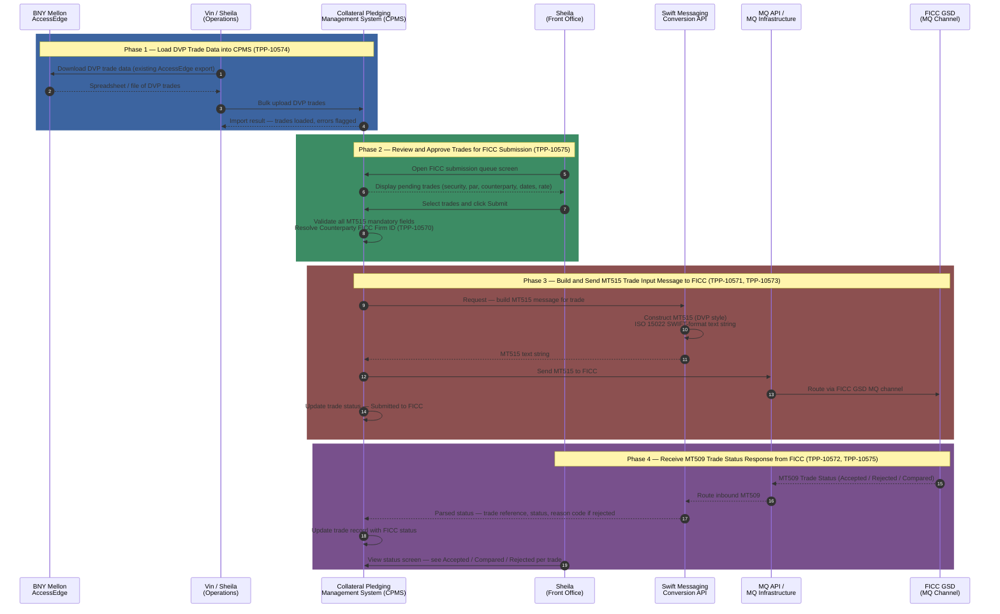
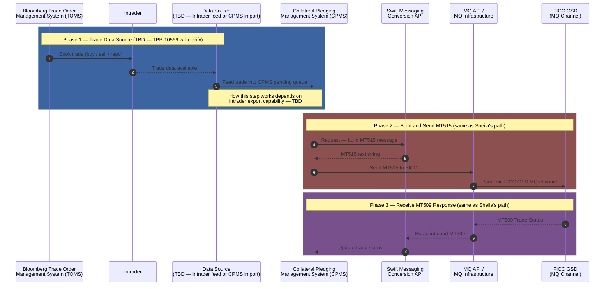
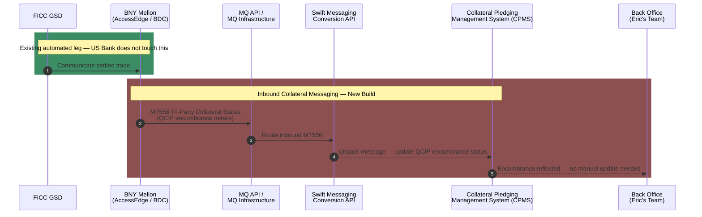

# TPP-10568 — High-Level Future State Flow
# Automate Treasury Trade Submission to FICC RTTM

## Track 1 — Front-End Trade Submission (Regulatory Deadline: Q3 2026)

---

## Track 1 — Money Center Trading / Investment Portfolio Path

> **Note:** The data source for this path is still to be determined (TBD). The Swift API → MQ → FICC leg is identical to Sheila's path. The open question is how trade data gets from Intrader into CPMS.

---

## Track 2 — Back-End Collateral Messaging (No Regulatory Deadline)

> This track automates the BNY Mellon collateral encumbrance update into CPMS after a trade settles. No hard deadline but reduces manual back-office work for Eric's team.

---

## Summary — Story to Flow Mapping

| Story | Phase | Depends On | Can Start |
|---|---|---|---|
| TPP-10569 — MT515 field mapping | Underpins all phases | None | Now |
| TPP-10573 — FICC MQ channel | Track 1 Phases 3 and 4 | None | Now — in parallel with TPP-10569 |
| TPP-10570 — Counterparty FICC Firm ID lookup | Track 1 Phase 2 | TPP-10569 | After TPP-10569 |
| TPP-10574 — BNY DVP download → CPMS upload | Track 1 Phase 1 | TPP-10569 | After TPP-10569 |
| TPP-10571 — MT515 message builder | Track 1 Phase 3 | TPP-10569, TPP-10570 | After TPP-10569 and TPP-10570 |
| TPP-10572 — MT509 response handler | Track 1 Phase 4 | TPP-10571, TPP-10573 | After TPP-10571 and TPP-10573 |
| TPP-10575 — CPMS submission and status UI | Track 1 Phases 2 and 4 | TPP-10569, TPP-10571, TPP-10572, TPP-10574 | Last — after all above |
